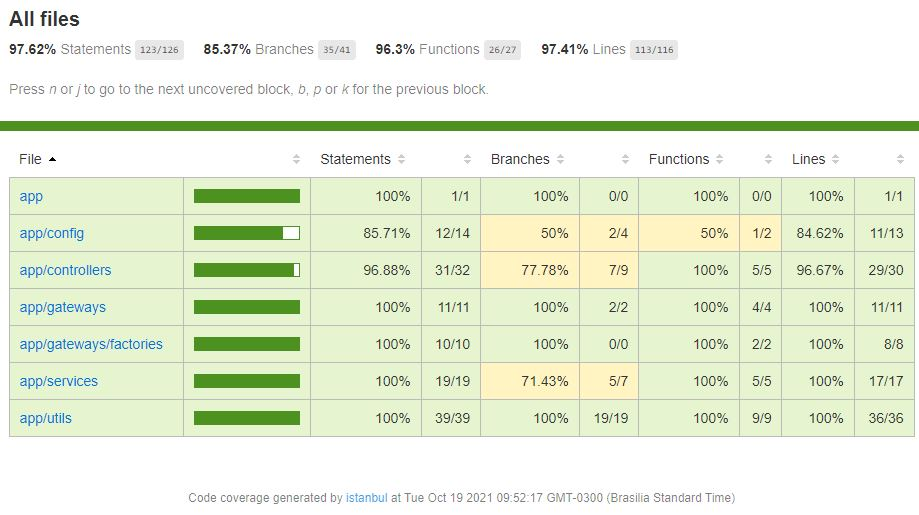

# Powerball API

## Game explanation

Powerball  is a popular US lottery game with draws twice a week. For the purposes of this exercise, a Powerball lottery "ticket" includes the date of the draw and one or more "picks". Each "pick" is a set of 5 integers (from `1`-`69`) along with a 6th integer (the _Powerball_, from `1`-`26`).

For example, a pick for the draw on `2017-11-09` might be:

`02 14 19 21 61` `25`

The API will accept data for a lottery ticket, and respond with whether each pick has won, the prize won per-pick, and the total of all prizes won on the ticket. It is up to you to design and build this API.

The Powerball winning numbers change on each "draw date". In order to determine a win or a loss, your application will have to retrieve the Powerball draw dates and winning numbers from the following public URL:

[https://data.ny.gov/resource/d6yy-54nr.json](https://data.ny.gov/resource/d6yy-54nr.json)

To calculate the prize, consult the prize matrix image below:


## Installation

This app requires:

- Node.js LTS 14+

If you do not have node.js installed:

1. [Install NVM](https://github.com/creationix/nvm#installation)
2. [Install Node 14](https://github.com/creationix/nvm#usage) `nvm install 14`
3. [Switch to Node 14](https://github.com/creationix/nvm#usage) `nvm use 14`

## Starting the App

1. Duplicate `.env.sample`, renaming it to `.env` and change to your oun preferences.

2. Run the commands in your terminal:

```bash
# install de dependencies
npm install

# to run in the development mode
npm run dev

# to transpile ts -> js
npm run build

# to run the project
npm start
```

You should see output like this:

```
node index.js
App listening on port 3000
```

You can then hit the default endpoint:

`http://localhost:3000/`

To shutdown the server simply send a `^C`.

## The API

Currently the API have three endpoints:

### GET /

You should see something like this:

```json
{
  "api-version": "0.1.0"
}
```

### GET /powerball/game?date=2021-10-13

Possible responses:

#### Success response

```json
{
  "draw_date": "2021-10-13T00:00:00.000",
  "winning_numbers": "23 29 47 59 60 15",
  "multiplier": "2"
}
```

#### With Game Error (not game found)

```json
{
  "hasError": true,
  "message": "No game in this date"
}

### POST /powerball/game/check

Body structure:

#### Game found

```json
{
  "date": "2021-10-13",
  "picks": [
    "23 29 47 59 60 26"
  ]
}
```

> Tip: It is possible to pass more than one pick

Possible responses:

#### The winner

```json
{
  "prizes": [
    {
      "pick": "23 29 47 59 60 15",
      "isGrandPrize": true,
      "prize": 0
    }
  ],
  "totalPrize": "Grand Prize"
}
```

#### Very lucky

```json
{
  "prizes": [
    {
      "pick": "23 29 47 59 60 26",
      "isGrandPrize": false,
      "prize": 1000000
    },
    {
      "pick": "23 29 47 59 60 14",
      "isGrandPrize": false,
      "prize": 1000000
    },
    {
      "pick": "21 28 46 58 61 15",
      "isGrandPrize": false,
      "prize": 4
    }
  ],
  "totalPrize": 2000004
}
```

#### With Pick Error

```json
{
  "hasError": true,
  "message": "Pick '23 29 47 59 60 27' is not valid"
}
```

#### With Game Error (not game found)

```json
{
  "hasError": true,
  "message": "No game in this date"
}
```

> TIP: It was generated a [Postman file](./docs/NeoFinancial.postman_collection.json)

## Testing

To run the tests, the project have 3 scripts:

```bash
# run once
npm run test

# run once and keep watching file changes
npm run test:watch

# run once and generates coverage
npm run test:coverage
```

You should see output like this:

```txt
Test Suites: 13 passed, 13 total
Tests:       50 passed, 50 total
Snapshots:   0 total
Time:        38.961 s
Ran all test suites.
```

> Tip: Open the file `./coverage/lcov-report/index.html` to see the coverage in a better way



# Roadmap

Due to time constraints, some implementations were planned for future releases.

* [ ] Finish Swagger implementation
* [ ] Add Caching in the `GET /powerball/game` route
* [ ] Add Logging
* [ ] Add Simples frontend application to consume the API
* [ ] Increase test cases
* [ ] Create `Dockerfile` and minimal DevOps struture
